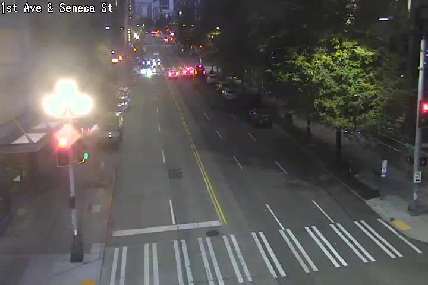
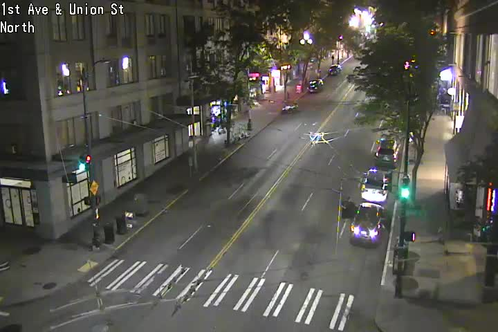
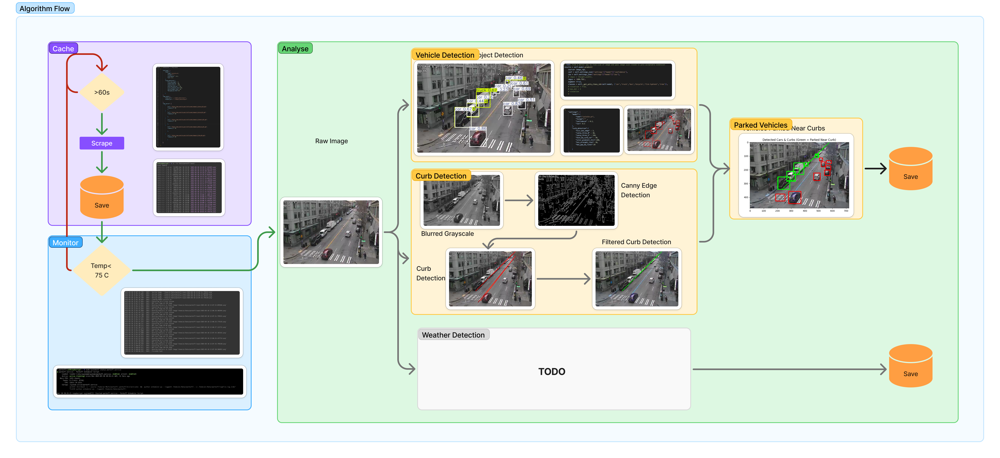
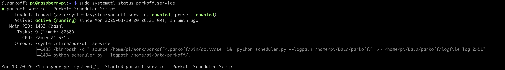
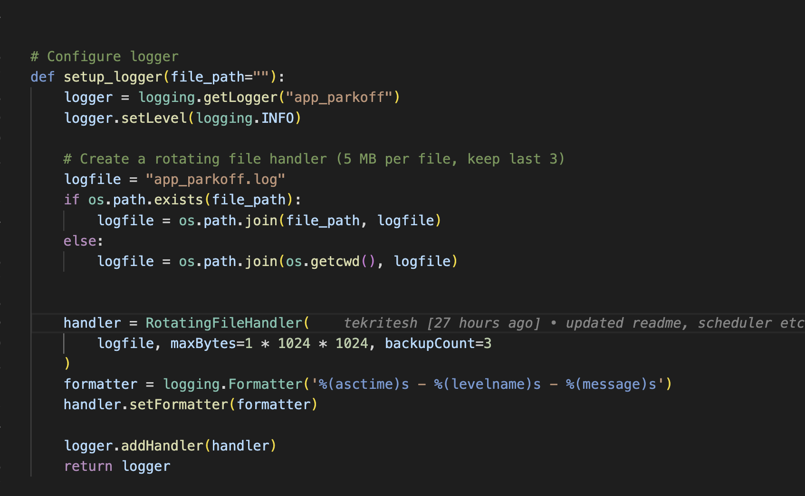
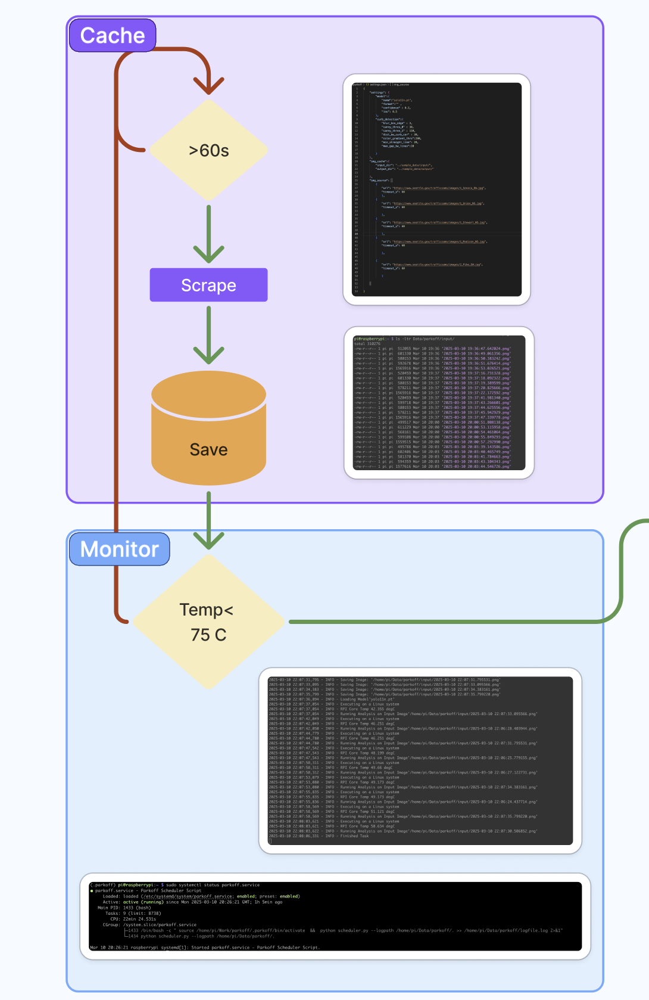
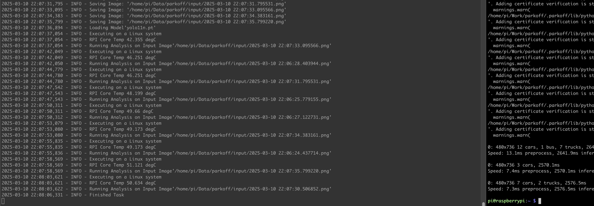

## Problem Statement/Objective:
**"Park Off"**

Finding a parking spot in downtown of any city is a major issue and especially with Return to Office policies, this can even intensified.  Moreover, if you live in downtown and prefer to walk, unruly weather is quite an annoyance. Here is an attempt to use Traffic Cams to find parking spots and street wise weather updates in near real time. 

## Introduction:

[Seattle Gov](https://www.seattle.gov/) has an extensive array of Traffic Cameras spread across the city that update the image and sometimes videos every minute. 


The cameras are located on all major jucntions and crossings and have a decent picture as you can see 

 



This project aims at querying this data, make a cache, and then run some object detection model on these images to find cars parked by the curbs.

A stretch goal is to detect the weather conditions by these images and get a near real time update if it is convinient to walk down a few blocks.

Finally, this could all be overlaid as a custom layer on Open Street Maps. 


## Project Outline and Goals:

-  Pipeline deployed on Raspberry Pi that downloads these Traffic Images near real-time and caches locally  &#9745;
- Vehicle detection using YOLO NCNN model &#9745;
- Curb Detection using Canny Edge Detection &#9745;
- Finding Parked Vehicles &#9745;
- Spot Empty Spaces for Potential Parking &#9744;
- Identify Rainy or Not Rainy Weather &#9744;
- Overlay Traffic Cam Position with the GIS Parking Data &#9744;
- Open Source Python Package for others to join in &#9744;
- App and Backend &#9744;
 

##  Constrains:
- Every Traffic Cam updates 1 min
- Glare often spoils the picture quality
- Perspective of Traffic Cams oftens makes it hard to identify Gaps in between cars


## Work Breakdown

| Feature                                     | Status              |
| -----------------------                     | -----------------   |
| YOLOv11 Test                                | &#9745; Completed   |
| ChatGPT Test                                | &#9745; Completed   |
| Seattle gov image scrape                    | &#9745; Completed   |
| Automated Scraping                          | &#9745; Completed   |
| JSON Project Configuration                  | &#9745; Completed   |
| Filter Yolo Objects                         | &#9745; Completed   |
| Fine Tune Yolo detector                     | &#9745; Completed   |
| Test ChatGPT for the above                  | &#9745; Completed   |
| Canny Edge Detection for Curbs              | &#9745; Completed   |
| Hough Lines to Find Long Stretches of Curbs | &#9745; Completed   |
| Fine Tuning Curb Detection                  | &#9745; Completed   |
| Filter Curbs Based Upon Color               | &#9745; Completed   |
| Find Vehicles Nearest to Curbs              | &#9745; Completed   |
| Subset Parked Vehicles                      | &#9745; Completed   |
| Find Gap between/Along Curbs                | &#9744; In progress |
| Weather Detection                           | &#9744; To do       |
| Cache Parking And Weather for each cam      | &#9744; To do       |
| Overlay on OSM                              | &#9744; To do       |


## Design Flow



## Folder Structure

**parkoff/parkoff:** Contains Functions and definition

**parkoff/tests:** Contains Unit Test Case

**parkoff/utils:** Contains Service Script for Raspberry Pi Deployment

## Installation

#### Install Python Dependency Manager

Refer : https://python-poetry.org/docs/


#### Install Local Dependencies
This should create a local env variable and install all the libs
```
cd parkoff
poetry install
```

#### Build Package
This should create *tar or *whl for us to invoke in any application under ```dist``` directory 
```
poetry build
```

#### Test Package
Local Test of the package
```
poetry run pytest
```

## Usage

### PC Development
Get the env variable name
```
poetry env info
```
- Use this variable for your py-kernel when you launch your jupyter instance in vscode. 
- If you cant find this, then:
- Ctrl/Cmd + P
- Select Python Interpreter
- Enter Interpreter Path
- Use the path as per ```poetry env info``` to add your ``venv`` to vs code


### RPI Deployment

#### Setting Up the PI

- Install 64-bit OS (Bookworm) in headless version 
- On RPI after successful SSH, create two folders to abstract code and data for cleanliness and easier management

```
mkdir -p Work
mkdir -p Data
```

Next we will copy the code base into RPI using **rsync**

```
rsync -a --exclude="/.*"  $GitClones/parkoff/parkoff/parkoff  pi@192.168.4.49:/home/pi/Work/parkoff/parkoff/

```
This ensure we only copy the code and nothing else

A quick test can be performed by running a sample test script before we automate the pipeline
But before that, we need to create a virtual environment

```
cd Work/parkoff
python -m venv .parkoff
source .parkoff/bin/activate
```

We need the packages that **parkoff** requires and that can be installed on RPi in two ways

- Using poetry on RPI ( requires installation and maybe heavy)
- Export the package information as a 'requirements.txt' and then install in the env variable


The latter is easier and more lightweight.

To export the packages on your host, navigate to the *pyproject.toml* and then export

```
cd  parkoff/parkoff
poetry export --without-hashes > requirements.txt

```
You will now see a **requirements.txt** with all the packages. Let's resysnc the repo with the RPI.


```
rsync -a --exclude="/.*"  $GitClones/parkoff/parkoff/parkoff  pi@192.168.4.49:/home/pi/Work/parkoff/parkoff/
```

Now let's install the packages

```
cd Work/parkoff
python -m venv .parkoff
source .parkoff/bin/activate
pip install -r parkoff/requirements.txt

```

If all goes well, you are ready to test the code.

```
python parkoff/tests/test.py

```

Once run, it should cache some output. 


#### Pipeline Setup

Python Scheduler is a OS agnostic framework. It helps automate scripts periodically. 


**parkoff/parkoff/scheduler.py:** calls the relevant functions every 60s to cache and analyse the data.

Next Linux Native System Service was used to run this scheduler as the RPI reboots. 

A sample service file is provided here **utils/parkoff.service**

```
[Unit]
Description=Parkoff Scheduler Script
After=network.target

[Service]
Type=simple
ExecStart=/bin/bash -c ' source /home/pi/Work/parkoff/.parkoff/bin/activate  &&  python scheduler.py --logpath /home/pi/Work/parkoff/. >> /home/pi/Data/parkoff/logfile.log 2>&1'
WorkingDirectory=/home/pi/Work/parkoff/parkoff/parkoff
User=pi
Group=pi
Restart=always
RestartSec=5

[Install]
WantedBy=multi-user.target

```

To create a service file, run the following and copy paste the above code into it

```
sudo nano /etc/systemd/system/parkoff.service
```

Next, we will enable the service and turn it on

```
sudo systemctl daemon-reload
sudo systemctl enable parkoff.service
sudo systemctl start parkoff.service

```


You can view the status of the service

```
sudo systemctl status parkoff.service
```
 

Or even stop it 
```
sudo systemctl stop parkoff.service
```


Next we will modify some of the file paths in the project settings.json to fit the rpi

```
{
    "settings": {
        "model":{
            "name":"yolo11n.pt",
            "format":"" ,
            "confidence" : 0.2,
            "iou": 0.5
        },
        "curb_detection":{
            "blur_box_edge" : 3,
            "canny_thres_0" : 30,
            "canny_thres_1" : 150,
            "dist_bw_curb_car" : 30,
            "color_gradient_thrs":200,
            "min_straight_line": 20,
            "max_gap_bw_lines":20

        }
    },
    "img_cache":{
        "input_dir": "/home/pi/Data/parkoff/input/",
        "output_dir": "/home/pi/Data/parkoff/output/"

    }

```

Once saved, we can restart the parkoff.service

```
sudo systemctl restart parkoff.service

```


Once done, you should be able to see the raw images being cached in ``` "/home/pi/Data/parkoff/input/"``` and the output being cached at ```/home/pi/Data/parkoff/output/```  with all the logs at
```/home/pi/Data/parkoff/```


#### Monitoring and Health

**Circular Logs**

The scheduler defines a circular logger to log all input of status
 

This saves at max 3 files of 1MB each.

You can monitor this in runtime by running

```
tail -f Data/parkoff/app_parkoff.log
```

**Temperature Monitoring**

There is built in temperature monitoring. Before every anaylysis of any image, the temperature is checked and only if the temperature is ```<75 degC``` the images are analysed. The below logs show how the temperature increases as every image is analysed.  

 


Here is a look at the logs on RPi
 

In case the temperature is over the set threshold, the service skips analysing the images and only caches the files. It is designed to come back for analysing at a later point in time. 


**Service Monitoring**

You can monitor the status of the service and it's logs by running 

```
sudo systemctl status parkoff.service

tail -f Data/parkoff/logfile.log

```

 


...

## Contributing


## Mass Production Readiness:
The package has been released on PyPi [here](https://pypi.org/project/parkoff/)


## Conclusion:
While this project is a Work in Progress, it bears some interesting possibilites with regards to monitoring and understand traffic patterns. It also confirms the fact that a RPI 4 is sufficient for the needs of such a work. 

## 8. References:
- [Wikipedia](https://www.wikipedia.org/)
- [RaspberryPi](https://www.raspberrypi.com/)
- [StackOverFlow](https://stackoverflow.com/)
